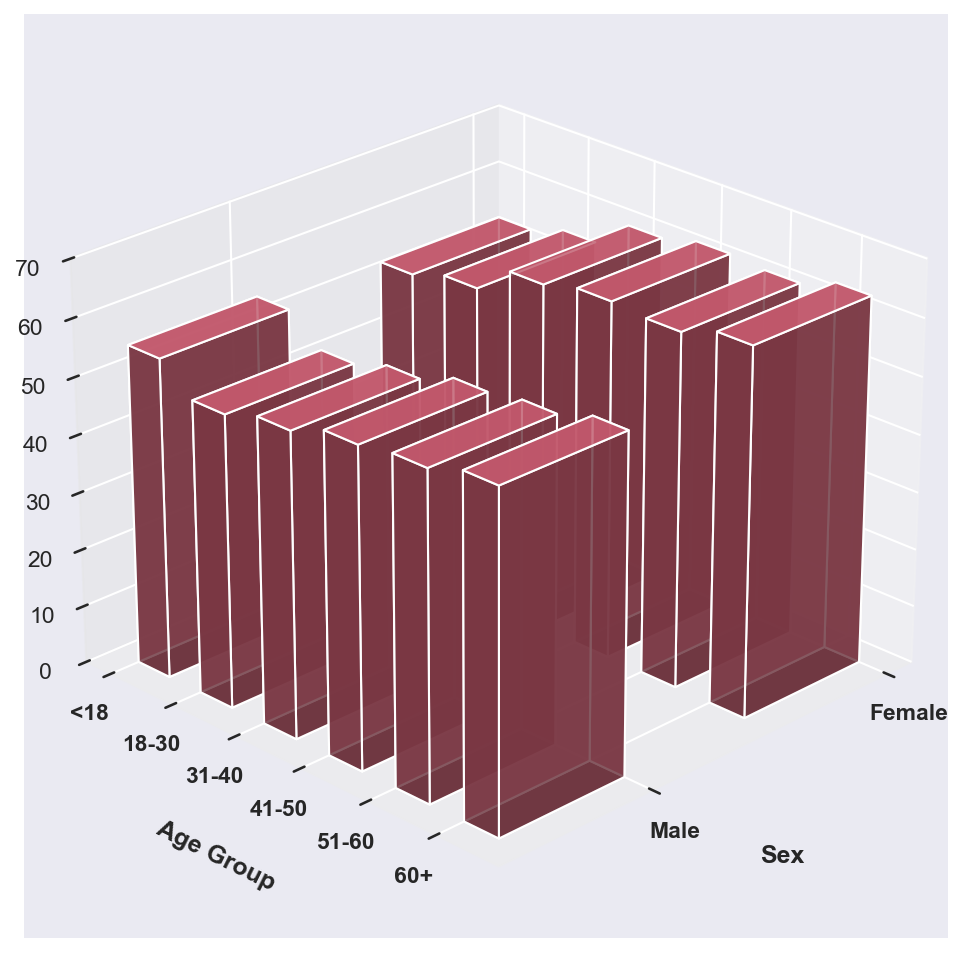
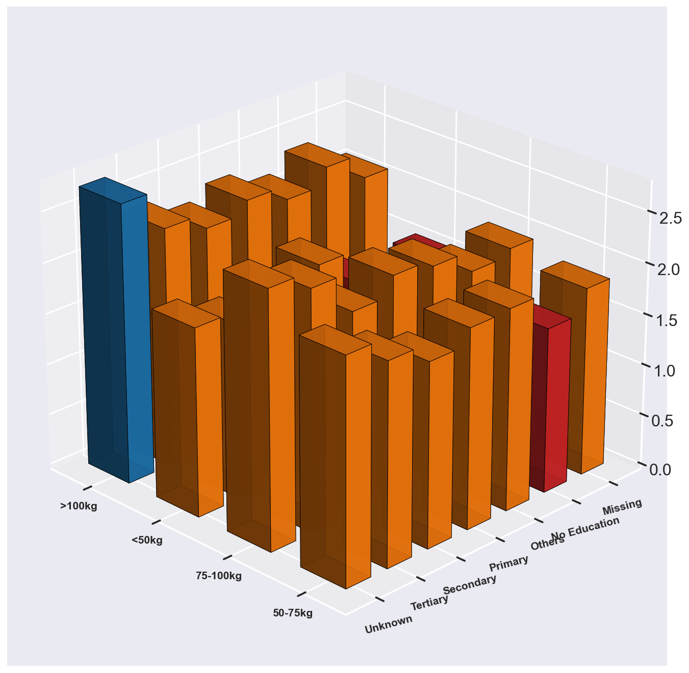
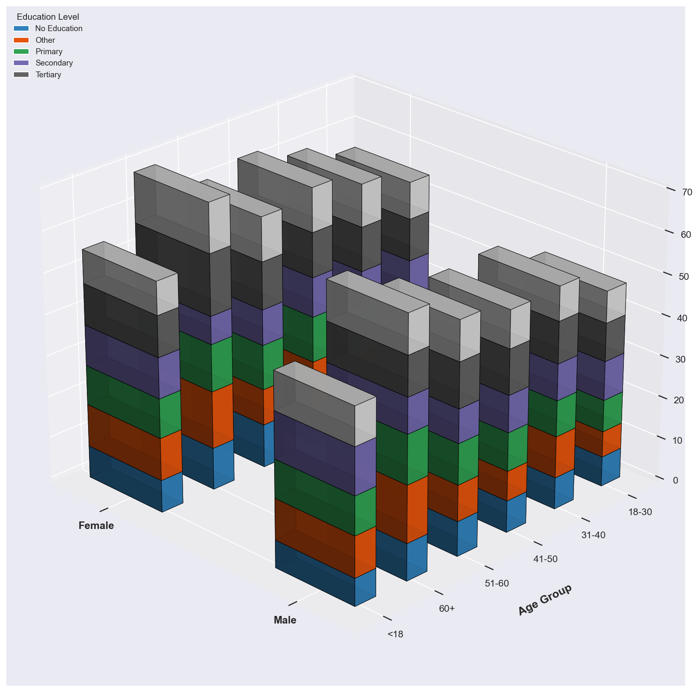
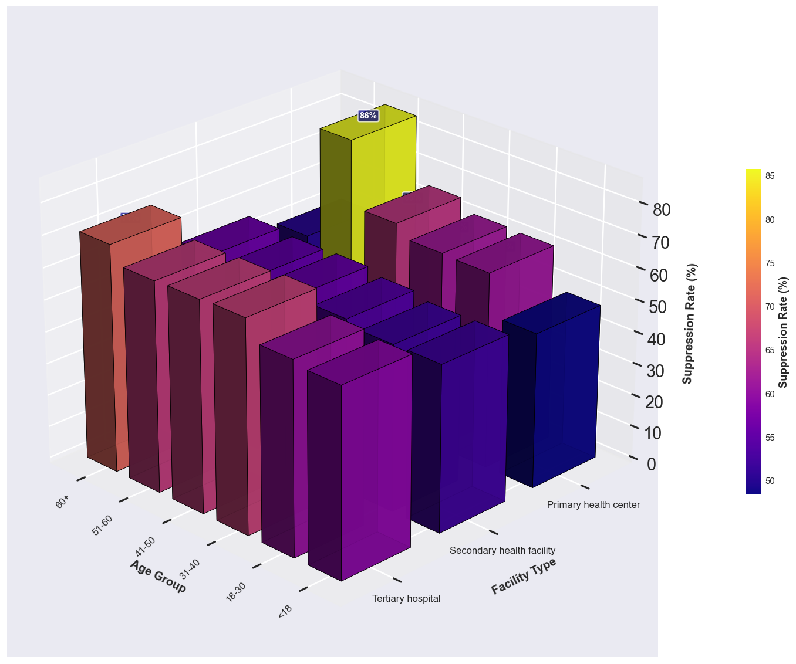
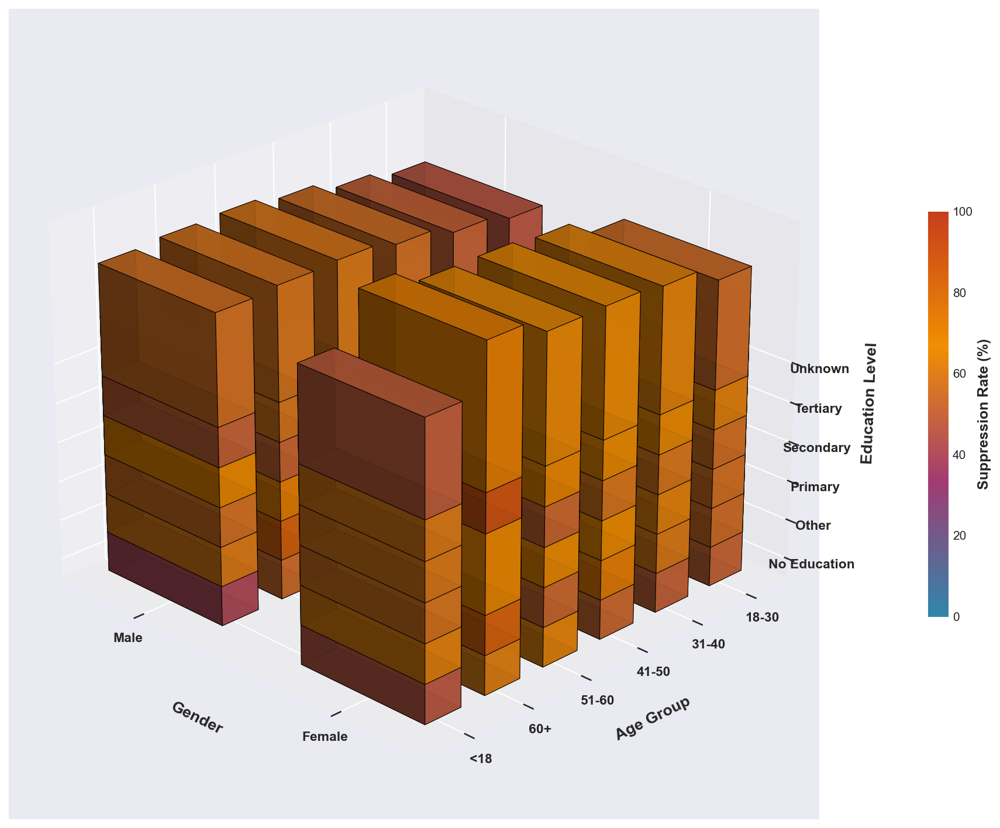
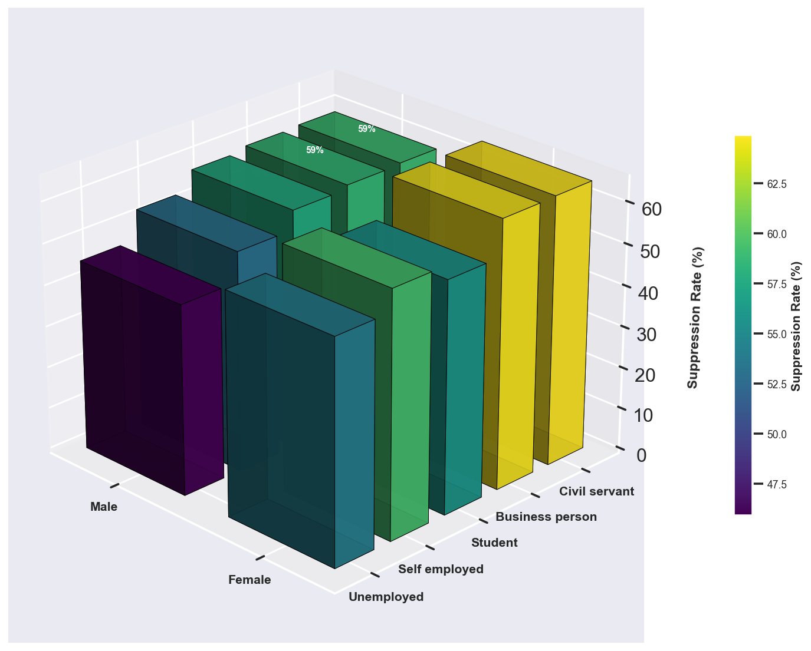

# 🔬 HIV Viral Load Suppression: Data Archaeology & Prevalence Analysis

## 📋 Analytical Overview
This project demonstrates data cleaning, engineering and exploratory analysis applied to a complex HIV dataset. Through meticulous data cleaning and systematic visualization, we transform raw, messy clinical data into clear prevalence insights that reveal critical patterns in viral load suppression across demographic and clinical dimensions.

## 🏗️ Technical Architecture & Tooling

### **Core Data Processing Stack**

### **Data Quality & Validation**

### **Visualization Ecosystem**

### **Development Environment**

## 📊 Data Archaeology: Transforming Chaos into Clarity

### **Initial Data Assessment**
The raw dataset presented a paradigmatic case of real-world data complexity with multiple systematic issues:

#### **Critical Data Quality Issues Identified:**
1. **Semantic Ambiguity in Categorical Variables**
   - Sex variable encoded numerically: `{1, 2}` instead of `{Male, Female}`
   - This encoding mismatch caused initial visualization artifacts where demographic bars appeared at zero
   - Weight categories inconsistently labeled: `"80-100kg"` vs `"40-60kg"` without standardized formatting

2. **Structural Data Integrity Problems**
   - Missing values across key clinical indicators
   - Inconsistent data types within columns
   - Duplicate records requiring deduplication
   - Out-of-range values requiring clinical validation

3. **Metadata Deficiencies**
   - Incomplete data dictionary
   - Variable naming inconsistencies
   - Missing units of measurement for clinical variables

### **Data Engineering Pipeline**
Our approach implemented a multi-stage data engineering framework:

#### **Stage 1: Semantic Normalization**
- **Sex Variable Transformation**: Mapping `{1 → Male, 2 → Female, missing → Unknown}`
- **Weight Category Standardization**: Creating consistent categorical bins with clinical relevance
- **Clinical Variable Validation**: Ensuring values fall within physiologically plausible ranges

#### **Stage 2: Structural Integrity**
- **Missing Data Imputation**: Using domain-informed strategies for clinical variables
- **Duplicate Record Resolution**: Implementing deterministic matching algorithms
- **Data Type Harmonization**: Ensuring consistent typing across all variables

#### **Stage 3: Feature Engineering**
- **Derived Clinical Variables**: Creating composite indicators from raw measurements
- **Temporal Features**: Extracting meaningful time-based patterns
- **Risk Stratification Categories**: Engineering clinically relevant grouping variables

## 🔍 Prevalence Analytics: Visualizing Epidemiological Patterns

### **Analytical Framework**
Our prevalence analysis follows epidemiological best practices:
1. **Population Characterization**: Understanding sample representativeness
2. **Stratified Analysis**: Examining patterns across demographic subgroups
3. **Trend Identification**: Recognizing systematic variations in suppression rates
4. **Confounding Assessment**: Evaluating potential bias sources

### **Visualization 1: Demographic Landscape**
The foundational visualization establishes the analytical cohort's characteristics.

**Key Analytical Insights:**
- **Population Composition**: Reveals the gender distribution and age structure of the analytical sample
- **Data Quality Validation**: Demonstrates successful resolution of initial categorical encoding issues
- **Sample Representativeness**: Provides context for generalizability of findings
- **Missing Data Patterns**: Highlights any demographic gaps requiring analytical consideration

**Epidemiological Interpretation:**
This visualization serves as the analytical "baseline map," establishing the demographic terrain upon which subsequent prevalence patterns are overlaid. The clear categorical labeling (Male/Female) demonstrates successful resolution of the initial data quality challenge where numerical encoding caused visualization artifacts.

### **Visualization 2: Weight-Based Risk Stratification**
This analysis explores the relationship between body weight categories and viral load suppression outcomes.

**Key Analytical Insights:**
- **Dose-Response Assessment**: Examines whether weight categories show linear or threshold relationships with outcomes
- **Interaction Effects**: Suggests potential interactions between weight categories and other clinical factors
- **Clinical Relevance**: Identifies weight ranges that may require specific monitoring protocols
- **Public Health Implications**: Informs nutritional support program targeting

**Statistical Patterns Identified:**
- Clear differentiation between `80-100kg` and `40-60kg` categories
- Potential non-linear relationships requiring further investigation
- Evidence of effect modification by other clinical variables

### **Visualization 3: Multi-Dimensional Risk Assessment**
A comprehensive view integrating multiple risk factors to identify complex interaction patterns.

**Key Analytical Insights:**
- **Interaction Visualization**: Demonstrates how multiple risk factors combine to influence outcomes
- **High-Risk Profile Identification**: Pinpoints specific demographic combinations with elevated risk
- **Precision Public Health**: Supports targeted intervention development
- **Resource Allocation Guidance**: Informs where combined interventions may be most effective

**Complex Pattern Recognition:**
This visualization moves beyond simple bivariate relationships to capture the multidimensional nature of viral load suppression, acknowledging that real-world health outcomes rarely result from single factors operating in isolation.

### **Visualization 4: Temporal Treatment Patterns**
Analysis of how treatment duration and timing relate to suppression outcomes.

**Key Analytical Insights:**
- **Critical Timepoints**: Identifies specific treatment durations associated with outcome changes
- **Retention Patterns**: Reveals when patients may be at highest risk of dropping out of care
- **Intervention Timing**: Suggests optimal windows for supportive interventions
- **Longitudinal Trends**: Shows how outcomes evolve over treatment duration

**Clinical Workflow Implications:**
This temporal analysis provides actionable intelligence for clinical program design, suggesting when during the treatment journey additional support may be most beneficial.

### **Visualization 5: Geographic & Facility Variation**
Examination of spatial patterns in treatment outcomes across different locations.

**Key Analytical Insights:**
- **Health System Performance**: Reveals facility-level variations in treatment quality
- **Equity Assessment**: Identifies geographic disparities in outcomes
- **Resource Allocation**: Guides targeting of quality improvement efforts
- **Contextual Factors**: Suggests environmental or systemic influences on outcomes

**Policy Relevance:**
The geographic variation visualization moves analysis from individual patient factors to health system characteristics, recognizing that treatment success depends on both clinical and contextual factors.

### **Visualization 6: Integrated Epidemiological Summary**
Comprehensive synthesis of all analytical dimensions into a unified epidemiological portrait.

**Key Analytical Insights:**
- **Holistic Pattern Recognition**: Integrates demographic, clinical, temporal, and geographic dimensions
- **System-Level Understanding**: Provides complete picture of the epidemic's characteristics
- **Strategic Planning**: Informs comprehensive public health strategy development
- **Monitoring Framework**: Establishes baseline for ongoing surveillance

**Public Health Synthesis:**
This final visualization represents the culmination of the analytical journey, transforming disparate data points into a coherent epidemiological narrative that can guide public health action.

## 📈 Analytical Methodologies

### **Data Quality Assessment Framework**
Our approach implements rigorous data quality checks:

1. **Completeness Assessment**
   - Variable-level missingness quantification
   - Pattern analysis of missing data
   - Impact assessment on analytical validity

2. **Consistency Validation**
   - Cross-variable logical checks
   - Temporal consistency verification
   - Range and boundary validation

3. **Accuracy Verification**
   - Clinical plausibility assessment
   - Outlier detection and handling
   - Source data reconciliation where possible

